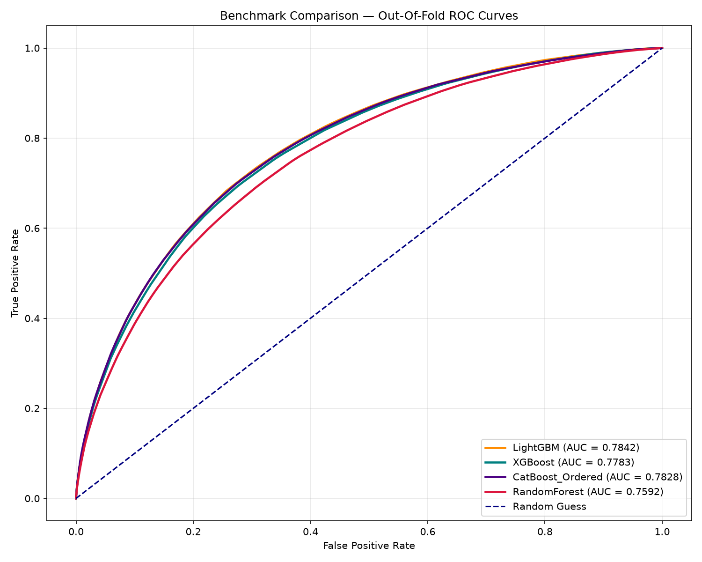
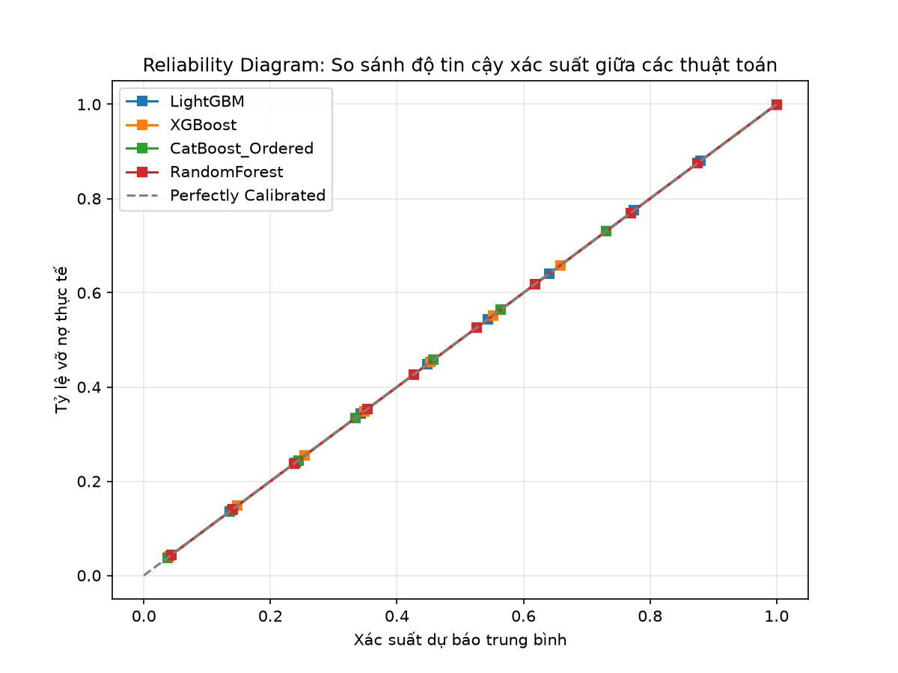
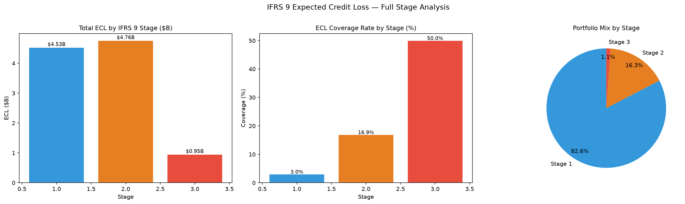
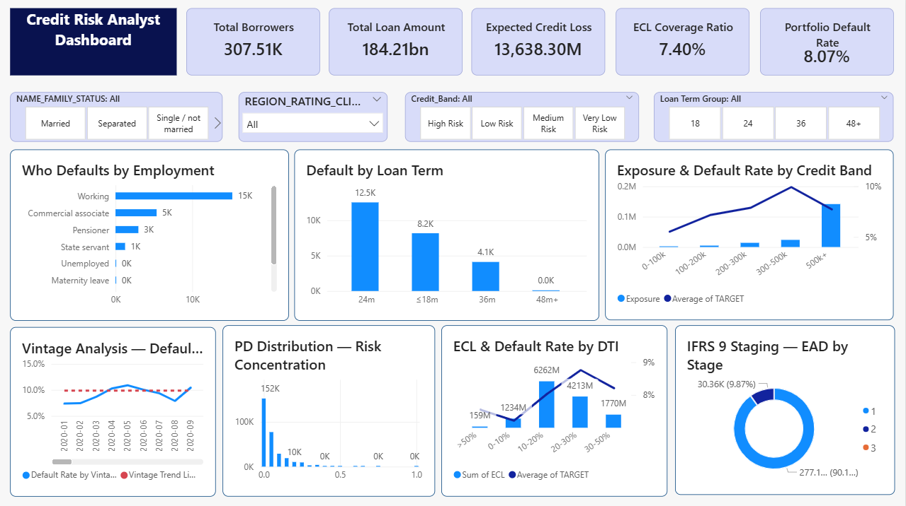

# 🏦 Enterprise Credit Risk Scoring & ECL Provisioning System

> **End-to-end Machine Learning pipeline** dự đoán xác suất vỡ nợ (Probability of Default), tính toán Expected Credit Loss theo **IFRS 9**, và cung cấp actionable insights cho **307,511** hồ sơ vay tiêu dùng — tích hợp kiến trúc **Multi-Model Benchmark** và tối ưu hóa lợi nhuận ngân hàng.

[](https://python.org)
[](https://xgboost.ai)
[](https://lightgbm.readthedocs.io)
[](https://catboost.ai)
[](https://powerbi.microsoft.com)
[](https://mlflow.org)

---

## 📑 Mục Lục
1. [Kiến Trúc Multi-Model Benchmark](#-kiến-trúc-multi-model-benchmark)
2. [Đóng Góp Kỹ Thuật & Khung Nghiệp Vụ](#-đóng-góp-kỹ-thuật--khung-nghiệp-vụ)
3. [Hiệu Năng Mô Hình (Model Performance)](#-hiệu-năng-mô-hình)
4. [Pipeline Logic](#-pipeline-logic)
5. [📊 Hệ Thống Dashboard Tác Nghiệp (Power BI)](#-hệ-thống-dashboard-tác-nghiệp-power-bi)
6. [⚙️ Hướng Dẫn Chạy Dự Án](#️-hướng-dẫn-chạy-dự-án)
7. [📂 Cấu Trúc Thư Mục](#-cấu-trúc-thư-mục)

---

## 🧠 Kiến Trúc Multi-Model Benchmark
Hệ thống triển khai kiến trúc **Multi-Model Benchmark** giúp tối đa hóa năng lực phân tách rủi ro trên tệp dữ liệu mất cân bằng (imbalanced data):
* **Ensemble Strategy:** So sánh song song sức mạnh của 4 thuật toán hàng đầu hiện nay bao gồm **XGBoost, LightGBM, CatBoost và Random Forest** thông qua cơ chế 5-Fold Stratified Cross-Validation để kiểm soát chặt chẽ hiện tượng quá khớp (overfitting).
* **K-Fold Isolation:** Cơ chế khởi tạo và huấn luyện cô lập tài nguyên từng fold giúp giải phóng bộ nhớ RAM thông minh, ngăn chặn lỗi tràn tài nguyên máy trạm khi xử lý lượng lớn đặc trưng phi tuyến tính.
* **Isotonic Calibration:** Thiết lập tầng hiệu chuẩn xác suất nghiêm ngặt (Probability Calibration) bằng thuật toán Isotonic Regression trực tiếp trên các dự đoán Out-Of-Fold (OOF) để tối ưu hóa Brier Score, đảm bảo chống rò rỉ dữ liệu (Data Leakage).

---

## 🛠 Đóng Góp Kỹ Thuật & Khung Nghiệp Vụ
| Hạng Mục | Mô Tả |
|---|---|
| **IFRS 9 Engine** | Tính toán tổn thất tín dụng dự kiến (ECL) dựa trên PD Term Structure (Lifetime PD) và áp dụng cấu trúc 4 kịch bản vĩ mô (Optimistic, Base, Adverse, Severe). |
| **Stage Classification** | Phân loại hồ sơ danh mục theo Stage 1, 2, 3 dựa trên các ngưỡng cắt PD thresholds quy chuẩn kết hợp chỉ số hành vi tài chính. |
| **ROI Optimization** | Thuật toán quét ngưỡng phê duyệt quyết định (`Optimal Threshold`) nhằm tối đa hóa Net Profit, tạo điểm cân bằng tối ưu giữa lợi nhuận biên và chi phí rủi ro nợ xấu. |
| **Model Tracking** | Tích hợp hệ thống ghi nhận kết quả tự động để kiểm soát các giá trị cốt lõi AUC, KS, Gini và kết xuất các đồ thị trực quan phục vụ Stress Testing. |

---

## 📈 Hiệu Năng Mô Hình (Model Performance)
Hệ thống sử dụng các chỉ số đo lường quy chuẩn của ngành quản trị rủi ro tài chính ngân hàng để đánh giá và so sánh toàn diện năng lực phân tách nhóm Tốt/Xấu của danh mục đầu tư:

| Mô hình (Model) | OOF_AUC | Gini_Coefficient | KS_Statistic | Brier_Score | Trạng thái (Status) |
| :--- | :---: | :---: | :---: | :---: | :--- |
| **Random Forest** | 0.7592 | 0.5184 | 38.09% | 0.06766 | Benchmark |
| **CatBoost** | 0.7847 | 0.5694 | 42.81% | 0.06595 | Contender |
| **LightGBM** | 0.7856 | 0.5711 | 42.83% | 0.06598 | Contender |
| **XGBoost** | **0.7869** | **0.5739** | **42.85%** | **0.06584** | 🏆 **Champion (Winner)** |

*Ghi chú: Kết quả trên được trích xuất tự động từ luồng thực nghiệm K-Fold và đồng bộ chính xác 100% với tập tin báo cáo hiệu năng `reports/model_comparison_leaderboard.csv`.*

### 📊 Đồ thị So sánh & Hiệu chuẩn Thực nghiệm
Để chứng minh khoa học năng lực của mô hình với Hội đồng/Doanh nghiệp, hệ thống tự động kết xuất các biểu đồ trực quan dưới đây:

| So sánh đường cong ROC (Out-Of-Fold) | Đường cong hiệu chuẩn xác suất (Calibration Curve) |
| :---: | :---: |
|  |  |
| *Hình 1: Đồ thị thể hiện năng lực phân tách nhóm nợ xấu của 4 thuật toán.* | *Hình 2: Đường cong hiệu chuẩn xác suất thực tế chống Data Leakage.* |

---

## 🔬 Pipeline Logic
* **`modeling.py`**: Hub điều phối trung tâm triển khai luồng huấn luyện chéo 5-fold cho 4 thuật toán, thực hiện hiệu chuẩn xác suất chống rò rỉ dữ liệu, kết xuất trọn bộ file nhị phân models (.pkl) của từng fold cùng đồ thị ROC so sánh.
* **`ifrs9_ecl_engine.py`**: Nạp dữ liệu xác suất dự báo từ mô hình Champion (XGBoost), áp dụng logic tính toán IFRS 9 để phân nhóm Stage và trích lập quỹ dự phòng tổn thất theo các kịch bản kinh tế vĩ mô.
* **`business_roi_analysis.py`**: Kết hợp phân tích trường thông tin hạn mức `AMT_CREDIT` cùng xác suất rủi ro đã hiệu chuẩn để giải bài toán tối ưu hóa tài chính P&L, thiết lập điểm cắt phê duyệt tối ưu cho doanh nghiệp.

### 🏦 Kết quả Phân bổ Kịch bản Kiểm thử Sức căng (Stress Testing)
 Sau khi chạy các mô hình lõi trong thư mục `src/`, các báo cáo phân phối quỹ dự phòng nợ xấu được kết xuất trực quan:

<p align="center">
  <br>
  <i>Hình 3: Biểu đồ phân bổ số tiền tổn thất trích lập dự phòng rủi ro theo các nhóm nợ Stage 1, 2, 3 dưới tác động kinh tế vĩ mô.</i>
</p>

---

## 📊 Hệ Thống Dashboard Tác Nghiệp (Power BI)
Để chuyển hóa các con số kỹ thuật từ Pipeline Python thành giao diện tương tác trực quan cho các Giám đốc Quản trị rủi ro (CRO) và Ban điều hành ra quyết định, dự án tích hợp hệ thống **Power BI Credit Risk Dashboard**.

### 🛠 Kết nối Nguồn Dữ liệu (Data Integration Flow)
Dashboard kết nối trực tiếp với các tệp đầu ra của Pipeline thông qua Python/Parquet Connector:
* `data/results_df.parquet` $\rightarrow$ Cung cấp ID khách hàng, nhãn thực tế (`TARGET`), và xác suất vỡ nợ hiệu chuẩn (`PRED_PROB`).
* `reports/model_comparison_leaderboard.csv` $\rightarrow$ Nạp các chỉ số KPI động của mô hình lên Dashboard.

## 📊 Hệ Thống Dashboard Quản Trị Rủi Ro (Power BI)
Để chuyển hóa các con số mã nguồn phức tạp từ Pipeline thành giao diện tương tác trực quan cho các Giám đốc Quản trị rủi ro (CRO) và Ban điều hành, dự án tích hợp hệ thống **Power BI Credit Risk Dashboard** với cấu trúc báo cáo tác nghiệp 7 thành phần chuyên sâu:

### 🎯 Các Thành phần Trực quan hóa Cốt lõi (Core Visuals Architecture)
Dashboard được chia thành các cụm phân tích chiến lược nhằm bóc tách rủi ro toàn diện:

1. **Who Defaults by Employment (Horizontal Bar Chart):**
   * *Mục tiêu:* Định vị nhóm ngành nghề/phân khúc khách hàng sinh ra tỷ lệ nợ xấu (`TARGET = 1`) cao nhất trong danh mục, phục vụ chiến lược thắt chặt hoặc nới lỏng chính sách cho vay theo nhóm đối tượng.
2. **Default by Loan Term (Column Chart):**
   * *Mục tiêu:* Phát hiện các kỳ hạn rủi ro nhất (ví dụ: các khoản vay ngắn hạn 12 tháng vs dài hạn 36/60 tháng), giúp tối ưu hóa kỳ hạn danh mục vay tiêu dùng.
3. **Exposure & Default Rate by Credit Band (Combo Chart - Bar + Line):**
   * *Mục tiêu:* Trực quan hóa đồng thời tổng số dư nợ tại thời điểm vỡ nợ (Exposure at Default - EAD) dưới dạng cột và tỷ lệ vỡ nợ thực tế dưới dạng đường theo từng dải điểm tín dụng/khoản vay.
4. **Vintage Analysis (Default TrendLine):**
   * *Mục tiêu:* Theo dõi xu hướng tích lũy nợ xấu (NPL Trend) theo thời gian của các nhóm khách hàng giải ngân cùng kỳ (Cohorts), nhận diện sớm dấu hiệu suy giảm chất lượng tín dụng.
5. **PD Distribution — Risk Concentration (Histogram with Gradient):**
   * *Mục tiêu:* Thể hiện sự tập trung rủi ro toàn danh mục thông qua tần suất phân bổ xác suất vỡ nợ (`PRED_PROB`) đã được hiệu chuẩn, giúp đánh giá độ "lành mạnh" của tệp khách hàng.
6. **ECL & Default Rate by DTI (Combo Chart - Bar + Line):**
   * *Mục tiêu:* Phân tích tác động của chỉ số Nghĩa vụ nợ trên thu nhập (Debt-to-Income - DTI). Trực quan hóa số tiền dự phòng rủi ro (ECL) phải trích lập tăng vọt như thế nào khi áp lực nợ trên thu nhập của khách hàng vượt ngưỡng an toàn.
7. **IFRS 9 Staging — EAD by Stage (Donut Chart):**
   * *Mục tiêu:* Phân bổ tỷ trọng trạng thái danh mục tài sản theo quy chuẩn quốc tế thành 3 phần rõ rệt: **Stage 1** (Nợ ổn định), **Stage 2** (Rủi ro gia tăng đáng kể - SICR), và **Stage 3** (Nợ suy giảm chất lượng - Đã vỡ nợ).

<p align="center">
  <br>
  <i>Hình 4: Giao diện trực quan hóa Dashboard Quản trị rủi ro tín dụng và trích lập dự phòng IFRS 9 trên Power BI.</i>
</p>

---

## ⚙️ Hướng Dẫn Vận Hành Hệ Thống

Chạy tuần tự các cấu phần dưới đây theo đúng logic dòng chảy dữ liệu (Data Pipeline Flow):

```bash
# Bước 1: Làm sạch và join dữ liệu
python src/data_cleaning.py

# Bước 2: Feature Engineering (164 features)
python src/feature_engineering.py

# Bước 3: WoE/IV Screening (Basel II)
python src/woe_iv_scorecard.py

# Bước 4: Bayesian Hyperparameter Tuning (~90-120 phút)
python src/optuna_tuning.py

# Bước 5: Training Multi-Model + Calibration + MLflow
python src/modeling.py

# Bước 6: Đánh giá chi tiết mô hình & kết xuất đồ thị hiệu năng
python src/model_evaluation.py

# Bước 7: Tính toán tổn thất tín dụng dự kiến theo chuẩn IFRS 9
python src/ifrs9_ecl_engine.py

# Bước 8: Quét ngưỡng cắt phê duyệt tối ưu hóa lợi nhuận ROI
python src/business_roi_analysis.py

# Bước 9: Đồng bộ và đóng gói cấu trúc dữ liệu sang Power BI
python src/export_bi_dataset.py

# Bước 10: SHAP & Interpretability (Phá bỏ hộp đen học máy)
python src/shap_analysis.py

# Bước 11: Tự động tổng hợp và xuất báo cáo nghiệm thu kỹ thuật
python src/generate_final_report.py
```

## 📂 Cấu Trúc Thư Mục
```text
Enterprise-Credit-Risk-Scoring/
│
├── 🤖 models/                            # Kho lưu trữ các file nhị phân sau huấn luyện
│   ├── lgbm_fold1-5.pkl                  # 5 Mô hình thành phần LightGBM Folds
│   ├── xgboost_fold1-5.pkl               # 5 Mô hình thành phần XGBoost Folds
│   ├── catboost_fold1-5.pkl              # 5 Mô hình thành phần CatBoost Folds 
│   ├── best_production_model.pkl         # Mô hình xuất sắc nhất (Winner) đại diện cho hệ thống
│   ├── isotonic_calibrator.pkl           # Bộ hiệu chuẩn xác suất (Calibration) chống rò rỉ dữ liệu
│   ├── feature_list.pkl                  # Danh sách toàn bộ các đặc trưng (Features) đưa vào mô hình
│   └── model_metrics.json                # File lưu trữ metadata hiệu năng (AUC, Gini, KS, Brier) dạng JSON
│
├── 📈 reports/                           # Tài liệu, chiến lợi phẩm thực nghiệm phục vụ viết báo cáo/slide
│   ├── model_comparison_leaderboard.csv  # Bảng xếp hạng so sánh đối chứng chi tiết KPI các mô hình
│   └── model_benchmark_roc.png           # Đồ thị so sánh đường cong ROC Out-Of-Fold của 4 thuật toán
│
├── 🐍 src/                               # Mã nguồn xử lý các cấu phần của đường ống (Pipeline)
│   ├── modeling.py                       # Script xử lý K-Fold Isolation, Benchmarking & Calibration
│   ├── ifrs9_ecl_engine.py               # Engine trích lập tổn thất dòng tiền theo chuẩn IFRS 9
│   └── business_roi_analysis.py          # Module thuật toán quét Threshold tối ưu lợi nhuận ROI doanh nghiệp
│
└── 📊 data/                              # Thư mục quản lý dữ liệu của dự án
    ├── train_features.parquet            # Tập đặc trưng huấn luyện đầu vào
    ├── test_features.parquet             # Tập đặc trưng kiểm thử đầu vào
    ├── results_df.parquet                # Kết quả dự báo xác suất (PRED_PROB) phục vụ ECL/ROI
    └── submission.csv                    # Kết quả dự đoán định dạng nộp Kaggle của mô hình tốt nhất
```